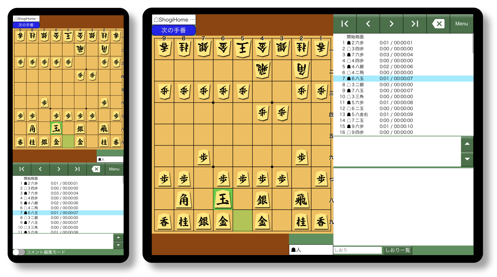

# ShogiHome

[](https://github.com/sunfish-shogi/shogihome/actions/workflows/test.yml)
[](https://codecov.io/gh/sunfish-shogi/shogihome)

[日本語](./README.md)

This is a Shogi GUI app.
You can play Shogi with AI and manage records.

You can use this app with any Shogi engine (AI) based on the [USI Protocol](http://shogidokoro.starfree.jp/usi.html), just like [将棋所](http://shogidokoro.starfree.jp/).

## Concept

Excellent shogi software such as 将棋所 and [ShogiGUI](http://shogigui.siganus.com/) already exist.
However, the source code of most of these programs are not public.
Authoritative Shogi AI developers have advocated [the importance of source code sharing](https://yaneuraou.yaneu.com/2022/01/15/new-gui-for-shogi-is-needed-to-improve-the-usi-protocol/).
ShogiHome publishes its source code fully. You can use or modify it under only a few restrictions.

ShogiHome is developed using [Electron](https://www.electronjs.org/) which is a web-based GUI framework.
We make use of modern web technologies since we want this project to see widespread usage in the future.
You can even run this on your web browser although only a portion of features are supported.
As an Electron-based app, this is bundled with Chromium, so it is easy to guarantee the same operability and quality across different OSs.

These days, 2-in-1 laptops are becoming popular.
It is now possible to play shogi on PCs with a touch screen.
However, legacy desktop Shogi apps have very small UI components. These are not good for compatibility with a touch display.
We designed this app to have operability for touch devices.

## Website

https://sunfish-shogi.github.io/shogihome/

You can try the web version from the website.

## Wiki

https://github.com/sunfish-shogi/shogihome/wiki

## Screenshots




## Downloads

You can download any version from [Releases](https://github.com/sunfish-shogi/shogihome/releases).

## Bug Reports / Suggestions

If you have a GitHub account, you can create an issue or a pull request.
For large changes, please open an issue to discuss them before starting development.
Make sure to use the provided templates when creating new issues or pull requests.

If not, please send messages through the [Web Form](https://form.run/@sunfish-shogi-1650819491).

You can see the development progress at [Project Board](https://github.com/users/sunfish-shogi/projects/1/views/1).

## Development

### Requirements

- Node.js

### Setup

```
git clone https://github.com/sunfish-shogi/shogihome.git
cd shogihome
npm install
```

### Launch

```
# Electron App
npm run electron:serve

# Web App
npm run serve
```

### Release Build

```
# Electron App (Installer)
npm run electron:build

# Electron App (Portable)
npm run electron:portable

# Web App
npm run build
```

### Unit Tests

```
# test only
npm test

# coverage report
npm run coverage
```

### Lint

```
npm run lint
```

## CLI Tools

- [usi-csa-bridge](https://github.com/sunfish-shogi/shogihome/tree/main/src/command/usi-csa-bridge#readme) - Communication bridge for USI and CSA protocol.

## Licences

### ShogiHome

[MIT License](LICENSE)

### Icon Images

This app uses [Material Icons](https://google.github.io/material-design-icons/) saved in [/public/icon](https://github.com/sunfish-shogi/shogihome/tree/main/public/icon).
These assets are provided under [Apache License 2.0](https://www.apache.org/licenses/LICENSE-2.0.txt).

### Dependencies

See [THIRD PARTY LICENSES](https://sunfish-shogi.github.io/shogihome/third-party-licenses.html) for libraries used from renderer process.

electron-builder bundles license files of Electron and Chromium into artifacts.
